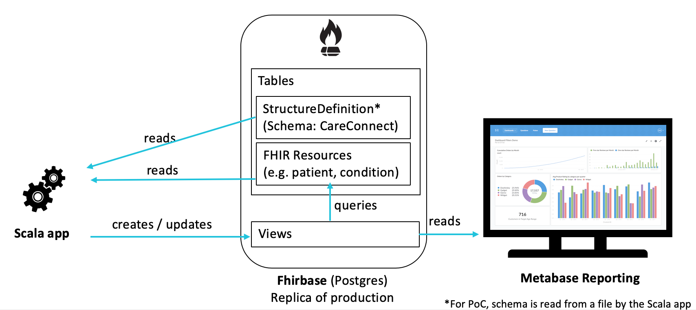

# FHIR Schema Converter

Convert FHIR resource definitions into Postgres views so they can be easily queries using SQL

**NB: This is a proof of concept and not currently intended for production use**

## High-level Architecture


## Prerequisites

A docker container with Postgres FHIR database. This includes synthetic data created using Synthea

```
docker run -d -p 3000:3000 -p 5432:5432 fhirbase/fhirbase:latest
```

## Running the application

```
sbt run
```

## Verifying results
- Connect to local postgres DB using a SQL client
host: localhost
database: fhirbase
user: postgres
pass: postgres

- run query (<viewname> is the resource name processed in lower case):
```
select * from <viewname>
```

## Metabase
### Setup
Pre-requisites:
* Docker
* Kitematic

1. Run the Metabase docker container using mounted file storage volume containing the Care Connect Profile Analysis dashboard
```
docker run -d -p 3001:3000 -v $PWD/metabase-data/metabase.db:/tmp/metabase.db -e "MB_DB_FILE=/tmp/metabase.db" --name metabase metabase/metabase
```

2. In Kitematic, select the new Metabase container and on the right-hand side of the window there will be a volumes window. Select the suggested mounted storage volume containing the metabase.db folder.

3. In Kitematic, select the Metabase container and then select the settings for this container. Under `Network`, scroll to the bottom and add a connection for the fhirbase container created in the Pre-Requisites section at the start of this readme. The connection alias should be `fhirbase`.

4. To log in to the Metabase dashboard, navigate to `localhost:3001` in a browser and use the following credentials:
```
Username: example.user@kainos.com
Password: password1
```

### Making changes to metabase
To save changes made to the metabase database, copy `metabase.db` folder from docker.
```
cd metabase-data
docker cp metabase2:/metabase.db ./
```


## Performance Testing
The default Docker container already contains about 1500 patients but to load more data:

1. Clone the Synthea repo and generate an extra 1000 records
```
git clone https://github.com/synthetichealth/synthea.git
cd synthea

sed -i '' "/exporter\.fhir\.bulk_data = / s/=.*/= true/" src/main/resources/synthea.properties

./gradlew build -x test

#Generate 1000 records in bulk format
./run_synthea -p 1000 -s 100
```

2. Stop existing Fhirbase container and start with this command to have a shared folder
```
docker run -v $PWD:/tmp/synthea -d -p 3000:3000 -p 5432:5432 fhirbase/fhirbase:latest
```

3. Log into docker container
```
docker ps -a 
<get container id for fhirbase>
docker exec -i -t <container id> /bin/bash
```

4. Import all the files previously created by Synthea
```
cd /tmp/synthea/output/fhir

for i in ./*.ndjson; do
 echo $i
 fhirbase --host localhost -p 5432 -d fhirbase -U postgres -W postgres --fhir=3.3.0 load -m insert $i
done
```
